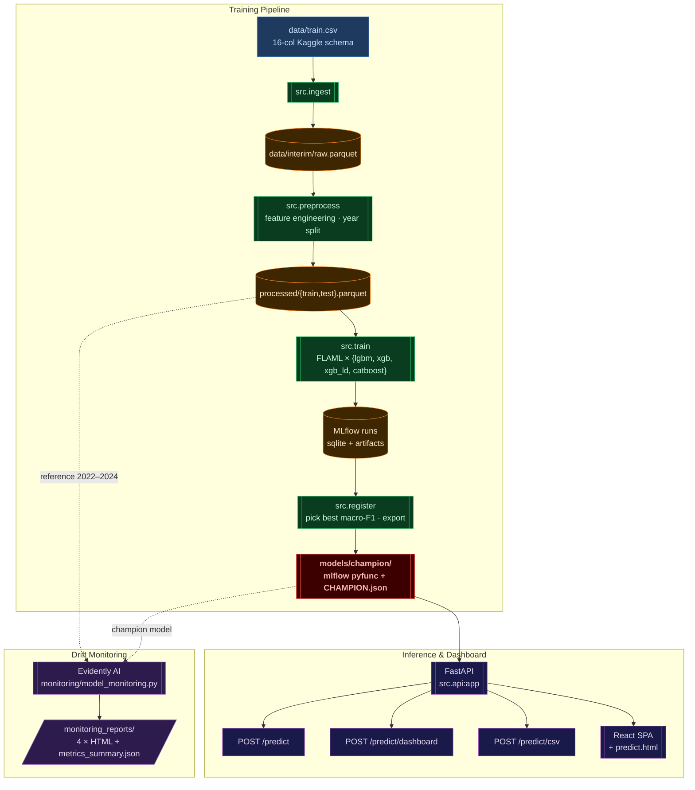

# F1 Pit-Stop Prediction

> Binary classifier predicting whether an F1 driver will pit on the **next** lap, trained on the Kaggle *Predicting F1 Pit Stops* dataset. Full MLOps loop: raw CSV → feature engineering → AutoML training → live inference UI → drift monitoring.

<p align="center">
  
  
  
  
  
</p>

<p align="center">
  <a href="https://t0myyy-f1-pit-predictor.hf.space/"></a>
  <a href="https://huggingface.co/spaces/T0MYYY/f1-pit-predictor"></a>
  
  
  
  
</p>

<p align="center">
  
  
  
  
  
  
</p>

<p align="center">
  
  
  
  
  
  
  
</p>

---

## 🔗 Live Demo

| | URL |
|---|---|
| **Dashboard (HF Space)** | <https://huggingface.co/spaces/T0MYYY/f1-pit-predictor> |
| **Direct app URL** | <https://t0myyy-f1-pit-predictor.hf.space> |
| **CSV batch inference** | <https://t0myyy-f1-pit-predictor.hf.space/predict.html> |
| **Health check** | <https://t0myyy-f1-pit-predictor.hf.space/health> |

`GET /` is the race-playback dashboard — the `REAL MODEL` toggle swaps synthetic predictions for live `predict_proba` calls. `GET /predict.html` is the drag-and-drop CSV inference page.

---

## 🏗 Architecture



---

## 📂 Repository Layout

```
F1-Pit-Stop-Prediction/
├── data/                          · Raw Kaggle CSVs + DVC-tracked outputs
├── notebooks/                     · EDA + feature-engineering source of truth
├── src/
│   ├── config.py                  · Paths, MLflow URI, RANDOM_SEED, AutoML config
│   ├── ingest.py                  · CSV → parquet (16-column schema check)
│   ├── feature_engineering.py     · add_features() — verbatim port of EDA notebook
│   ├── preprocess.py              · FE + year split + build_preprocessor()
│   ├── train.py                   · FLAML per-algorithm AutoML, MLflow per-run logs
│   ├── register.py                · Champion selection, MLflow Registry, export
│   ├── inference.py               · prepare_features() · load_*_model() · CLI
│   └── api.py                     · FastAPI app — /predict, /predict/dashboard, /predict/csv
├── dashboard/                     · React + Babel SPA (CDN, no build) + predict.html
├── deploy/hf/                     · HF Docker Space — Dockerfile, requirements, push_space.py
├── dags/pit_stop_training_dag.py  · Airflow DAG — 4 BashOperators wrapping src.*
├── tests/                         · Import + config-path smoke tests
├── models/champion/               · Deployed champion (XGBoost pyfunc + CHAMPION.json)
├── monitoring/
│   └── model_monitoring.py        · Evidently AI drift monitoring (4 scenarios)
├── monitoring_reports/            · Generated HTML reports + metrics_summary.json
├── docker-compose.yaml            · Airflow LocalExecutor + Postgres
├── dvc.yaml / dvc.lock            · DVC pipeline (ingest, preprocess stages)
└── requirements.txt               · Pinned versions
```

---

## 👥 Team

| Name | Contribution |
|---|---|
| **Yuang Zou** | EDA, feature engineering, baseline modelling |
| **Zihao Huang** | Training pipeline — Airflow DAG, MLflow experiment tracking, DVC |
| **Tom Chen** | FastAPI serving, React dashboard, Hugging Face Space deployment |
| **Leo Liu** | Model monitoring — Evidently AI drift scenarios |

---

## 📄 Dataset & License

Dataset: [Predicting F1 Pit Stops](https://kaggle.com/competitions/playground-series-s6e5) — Yao Yan, Walter Reade & Elizabeth Park (Kaggle Playground Series, 2026). Licensed under [CC BY 4.0](https://creativecommons.org/licenses/by/4.0/).

---

## ⚡ Quick Start

### Predict with the trained champion (no training needed)

The champion is committed at [`models/champion/`](models/champion/) (5.4 MB, XGBoost via FLAML). A clean clone is enough to serve predictions.

```bash
git clone https://github.com/EdwardHuang777/F1-Pit-Stop-Prediction.git
cd F1-Pit-Stop-Prediction

python3.12 -m venv .venv && source .venv/bin/activate
pip install -r requirements.txt
pytest tests/                                            # 2/2 smoke tests
python -m src.inference --input data/train.csv --year 2025   # batch predict on 2025 holdout
```

### Run the inference UI locally

```bash
pip install -r requirements.txt
uvicorn src.api:app --host 0.0.0.0 --port 7860
# Dashboard:   http://localhost:7860/
# CSV upload:  http://localhost:7860/predict.html
# Health:      http://localhost:7860/health
```

### Docker

```bash
docker build -f deploy/hf/Dockerfile -t f1-pit-predictor .
docker run -p 7860:7860 f1-pit-predictor
```

Deploy to your own HF Space: `python deploy/hf/push_space.py` (requires `hf auth login`; update `REPO_ID` first).

---

## 🔌 API Endpoints

[`src/api.py`](src/api.py) exposes:

| Endpoint | Body | Use case |
|---|---|---|
| `GET /health` | — | Liveness probe |
| `POST /predict` | `{"records":[{...raw 15 cols}]}` | JSON inference |
| `POST /predict/dashboard` | `{race, year, rows:[{driver, lap, compound, …}]}` | Dashboard real-model toggle |
| `POST /predict/csv` | `multipart/form-data file=…csv` | Drag-and-drop CSV inference |
| `GET /` | — | Serves `dashboard/index.html` |

**Load the champion directly in Python:**

```python
import mlflow.sklearn
model = mlflow.sklearn.load_model("models/champion")
probs = model.predict_proba(features_df)[:, 1]
```

**Input shape.** A DataFrame with the 15 raw columns from [`src/config.py:RAW_COLUMNS`](src/config.py) excluding `PitNextLap`. Feature engineering (lags, rolling means, tyre-life buckets, race-phase flags) is applied inside `prepare_features()`. Send a full driver-stint history per request so lag/rolling features populate correctly.

**Refresh cadence.** When the training pipeline retrains, `models/champion/` is updated in-place. A `git pull` and process restart on the HF Space picks it up — no schema changes, no client work.

---

## 🏆 Champion History

| Version | Algorithm | macro-F1 | ROC-AUC | Notes |
|---|---|---:|---:|---|
| 1 | CatBoost | 0.7834 | 0.8944 | Host-trained, 600s budget |
| **2 (current)** | **XGBoost** | **0.7852** | **0.8945** | DAG-trained champion, deployed |

---

## 📊 Model Monitoring

Drift monitoring is implemented in [`monitoring/model_monitoring.py`](monitoring/model_monitoring.py) using **Evidently AI**. The script runs four scenarios against the champion model, using 2022–2024 processed data as reference and 2025 as current:

| Scenario | Change | macro-F1 | ROC-AUC | Pit% predicted |
|---|---|---:|---:|---:|
| S1 | Original test data | 0.785 | 0.894 | 25.3% |
| S2 | TyreLife +20 | 0.666 | 0.829 | **54.7%** |
| S3 | Compound → SOFT | 0.751 | 0.856 | 25.5% |
| S4 | Degradation ×2 | 0.782 | 0.891 | 25.6% |

**Key finding:** `TyreLife` is the most sensitive feature. A +20 lap shift drops F1 by 0.119 and more than doubles the predicted pit rate (25% → 55%). Any upstream data error in TyreLife should trigger an immediate alert. `Compound` has a moderate effect (−0.034 F1); `Cumulative_Degradation` is robust (−0.003), compensated by correlated features.

```bash
pip install evidently==0.4.33
python monitoring/model_monitoring.py
# Reports saved to monitoring_reports/ — open any HTML in a browser
```

### Note on the 2023 anomaly

Year 2023 has ~0.96% pit-next-lap rate vs ~28% in other years — a **Kaggle Playground synthetic artifact**, not actual drift (documented in [`notebooks/EDA.ipynb`](notebooks/EDA.ipynb) §7). Label it as `data-source artifact` in any year-sliced dashboard to avoid false alerts.

---

## 🛠 Pipeline Reference

### A) Standalone Python (~12 min)

```bash
python -m src.ingest        # ~2s
python -m src.preprocess    # ~30s
python -m src.train         # ~12 min (4 × FLAML @ 150s/algo)
python -m src.register      # ~5s
```

Override budget: `TIME_BUDGET=80 python -m src.train` (~2 min smoke run).

### B) Airflow DAG via Docker (~20–25 min)

```bash
mkdir -p mlflow              # one-time after fresh clone
docker compose build         # ~10 min first time; cached after
docker compose up -d
# http://localhost:8080  →  admin / admin  →  trigger pit_stop_training
# Default budget {"time_budget": 600}.  Use {"time_budget": 80} for smoke.
docker compose down
```

Each `src.*` runs as a `BashOperator` subprocess (not PythonOperator — avoids a fork-after-thread bug with native ML libs).

### C) DVC (data stages only)

```bash
dvc repro   # replays ingest + preprocess; does not run train/register
```

### MLflow

- **Backend:** SQLite at `mlflow/mlflow.db`, artifacts at `mlflow/artifacts/`
- **Tracking URI:** `sqlite:///mlflow/mlflow.db` ([`src/config.py:21`](src/config.py#L21))
- **UI:** `mlflow ui --backend-store-uri sqlite:///mlflow/mlflow.db --port 5001`

> **Host ↔ Docker caveat.** MLflow stores absolute artifact paths at experiment-creation time. When switching environments, wipe `mlflow/` and `mlruns/` first. `models/champion/` is unaffected.

---

## ♻️ Reproducibility

- **Python:** 3.12 (host and Docker)
- **Random seed:** 42 — set in [`src/config.py`](src/config.py), threaded into FLAML via `clf__seed`
- **Pinned deps:** [`requirements.txt`](requirements.txt)
- **Data identity:** SHA256 of `data/processed/*.parquet` stored in `CHAMPION.json`
- **Code identity:** git SHA stored in `CHAMPION.json`

---

## ⚠️ Gotchas

- **First Docker build is ~10 min** (catboost + xgboost + lightgbm + arm64 wheels). Cached afterward.
- **CatBoost is slow inside arm64 Docker.** A 600s-budget DAG run can take 20–25 min; host venv is ~2× faster.
- **Don't `rm -rf mlflow/` while Docker is up.** Run `docker compose down` first.
- **Switching host ↔ Docker:** wipe `mlflow/` and `mlruns/` between environments. `models/champion/` survives.
- **`data/train.csv` is >50 MB.** GitHub warns but does not block — committed for grader convenience.
- **HF Space requires `flaml` and `lightgbm`** even though the champion is XGBoost — the FLAML wrapper leaves references in the pickle. See [`deploy/hf/requirements.txt`](deploy/hf/requirements.txt).

---

## 🤝 Retrain Workflow

1. Pull latest data if changed.
2. `python -m src.train` (host) or trigger the Airflow DAG (Docker).
3. `python -m src.register` runs as the final DAG task; run manually otherwise.
4. Verify `models/champion/CHAMPION.json` — confirm `test_macro_f1` beats the prior champion.
5. `git add models/champion/ && git commit -m "Champion v{N}: {algo}, F1={X}"`.
6. `git push` — re-run `python deploy/hf/push_space.py` to ship to the live Space; update the drift monitoring baseline.

---

*Banner: Pirelli F1 tyre range (Soft · Medium · Hard · Intermediate · Wet). Photo via Wikimedia Commons, CC BY-SA.*
