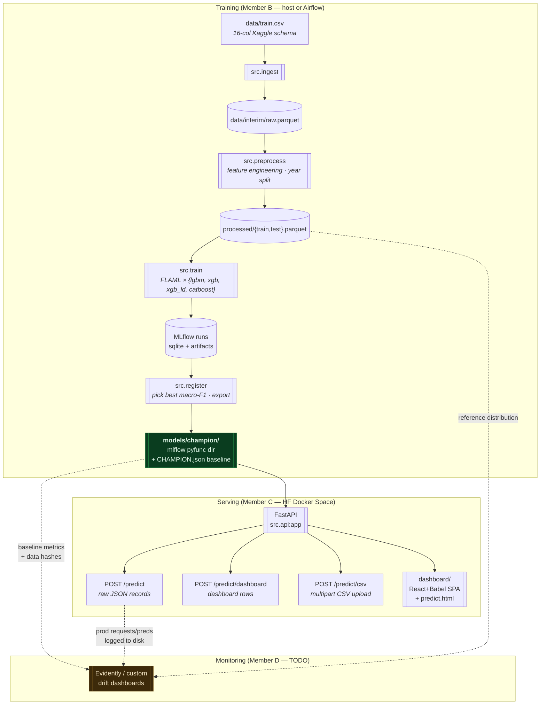
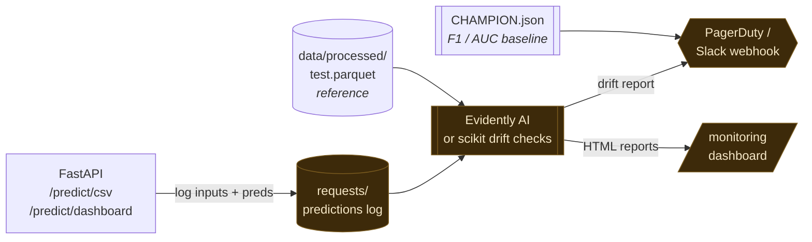

# F1 Pit-Stop Prediction

> Binary classifier predicting whether an F1 driver will pit on the **next** lap. Built on Kaggle Playground Series **S5E6** (2022–2025) — full MLOps loop from raw CSV to a live, deployable inference UI.

<p>
  <a href="https://huggingface.co/spaces/T0MYYY/f1-pit-predictor"></a>
  
  
  
  
</p>

---

## 🔗 Live demo

| | URL |
|---|---|
| **Dashboard (HF Space)** | <https://huggingface.co/spaces/T0MYYY/f1-pit-predictor> |
| **Direct app URL** | <https://t0myyy-f1-pit-predictor.hf.space> |
| **CSV batch inference UI** | <https://t0myyy-f1-pit-predictor.hf.space/predict.html> |
| **Health check** | <https://t0myyy-f1-pit-predictor.hf.space/health> |

The space serves a FastAPI app behind the engineer-facing dashboard:
- `GET /` — race-playback dashboard. Right-side toolbar exposes a `REAL MODEL` toggle that swaps synthetic predictions for live `predict_proba` calls.
- `GET /predict.html` — drag-and-drop CSV inference. Returns per-row `pPit` + `pred`, optional macro-F1 if `PitNextLap` is included.
- `POST /predict`, `POST /predict/dashboard`, `POST /predict/csv` — JSON / multipart endpoints.

---

## 🚦 Handoff status


> **Member C is complete.** The dashboard, the live REAL MODEL toggle, the CSV batch UI, the FastAPI service, and the Hugging Face Docker deployment all live on the [`dashboard`](https://github.com/EdwardHuang777/F1-Pit-Stop-Prediction/tree/dashboard) branch and are running at the URL above. **Member D is the next handoff** — see [§ For Member D](#-for-member-d--drift-monitoring) below.

---

## 🏗 Architecture



---

## ⚡ Quick start

### Predict with the trained champion (no training needed)

The champion is committed at [`models/champion/`](models/champion/) (5.4 MB, XGBoost). A clean clone is enough to serve predictions.

```bash
git clone https://github.com/EdwardHuang777/F1-Pit-Stop-Prediction.git
cd F1-Pit-Stop-Prediction

python3.12 -m venv .venv && source .venv/bin/activate
pip install -r requirements.txt
pytest tests/                                # 2/2 smoke tests
python -m src.inference --input data/train.csv --year 2025  # batch predict on 2025 holdout
```

### Run the full inference UI locally (mirror of the HF Space)

```bash
git checkout dashboard            # full-stack assets live here
pip install -r requirements.txt
uvicorn src.api:app --host 0.0.0.0 --port 7860
# Dashboard:   http://localhost:7860/
# CSV upload:  http://localhost:7860/predict.html
# Health:      http://localhost:7860/health
```

### Reproduce the Docker deployment

```bash
git checkout dashboard
docker build -f deploy/hf/Dockerfile -t f1-pit-predictor .
docker run -p 7860:7860 f1-pit-predictor
```

### Retrain (Member B's loop)

```bash
python -m src.ingest         # ~2s
python -m src.preprocess     # ~30s
python -m src.train          # ~12 min (4 × FLAML @ 150s/algo)
python -m src.register       # ~5s · writes models/champion/
```

Or via Airflow (`docker compose up -d` → trigger `pit_stop_training`).

---

## 🔬 For Member C — FastAPI service ✅

> **Status: shipped.** Code on [`dashboard`](https://github.com/EdwardHuang777/F1-Pit-Stop-Prediction/tree/dashboard), deployed to [T0MYYY/f1-pit-predictor](https://huggingface.co/spaces/T0MYYY/f1-pit-predictor).

The champion is a self-contained MLflow model directory. **No tracking server or sqlite needed** — just load the directory:

```python
import mlflow.sklearn
model = mlflow.sklearn.load_model("models/champion")
probs = model.predict_proba(features_df)[:, 1]   # raw probabilities
```

**Endpoints exposed by [`src/api.py`](src/api.py) on the `dashboard` branch:**

| Endpoint | Body | Use case |
|---|---|---|
| `POST /predict` | `{"records":[{...}]}` (raw lap JSON) | Original int-label endpoint, kept for backward compatibility |
| `POST /predict/dashboard` | `{race, year, rows:[{driver, lap, compound, …}]}` | Per-driver request fired by the React dashboard's `REAL MODEL` toggle |
| `POST /predict/csv` | `multipart/form-data file=…csv` | Drag-and-drop CSV inference for `/predict.html` |
| `GET /health` | — | Liveness probe |

**Input shape & schema.** A pandas DataFrame with the 15 raw columns (everything in [`src/config.py:RAW_COLUMNS`](src/config.py) except `PitNextLap`). All feature engineering — lag features, rolling means, tyre-life buckets, early/late-race flags — is rebuilt inside `prepare_features()` ([`src/inference.py`](src/inference.py)), so the API only needs the raw 15 columns. Grouping is by `(Year, Race, Driver, Stint)` so **send a full driver-stint history per request** for the lag/rolling features to populate correctly.

**Refresh cadence.** When Member B retrains, `models/champion/` is updated in-place. A `git pull` and process restart picks it up. Nothing else changes.

**Dashboard branch contents** (everything Member C produced):
```
dashboard/
├── index.html              · main dashboard (React + Babel via CDN)
├── pp-app.jsx              · console + strategy-wall views, REAL MODEL toggle, scrubber
├── pp-data.jsx             · synthetic race generator (deterministic, mulberry32 PRNG)
├── pp-ui.jsx               · primitives (tags, gauges, sparks, tyres)
├── tweaks-panel.jsx        · settings panel
└── predict.html            · standalone CSV upload page
deploy/hf/
├── Dockerfile              · python:3.12-slim + libgomp1
├── requirements.txt        · inference-only (flaml + lightgbm required for the pickle)
├── README.md               · HF Space frontmatter
└── push_space.py           · automated deploy: stage → upload_folder → done
```

---

## 🟡 For Member D — drift monitoring

> **Status: not started.** Hooks and baselines are in place; the monitor itself is yours to build.

Three artifacts you already have:

1. **`models/champion/CHAMPION.json`** — drift baseline:
   - `metrics.test_macro_f1`, `metrics.test_roc_auc` → performance floor to alert against
   - `training_data.train_parquet_sha256` / `test_parquet_sha256` → identity hashes. Recompute on incoming data and compare — divergence ≠ drift, but tells you the dataset changed.
   - `algorithm`, `best_hyperparams`, `trained_at_utc`, `git_sha`, `registered_version` → provenance for the alert payload.

2. **`data/processed/test.parquet`** — the **2025 reference distribution** for feature-drift detection (Evidently AI's reference dataset slot, KS tests, PSI, etc.).

3. **The deployed FastAPI** — wire request/prediction logging into [`src/api.py`](src/api.py) `predict_dashboard` / `predict_csv` to capture production inputs and predictions, then diff against the reference distribution.

### Heads-up: the 2023 anomaly is not real drift

Year 2023 has ~0.96% pit-next-lap rate vs ~28% in 2022/2024/2025 — a **Kaggle Playground synthetic artifact**, not actual drift. Member A flagged this in [`notebooks/EDA.ipynb`](notebooks/EDA.ipynb) §7. If your dashboard slices by year, label it as `data-source artifact, not model drift` so the on-call doesn't chase a ghost.

### Suggested architecture



### What "done" looks like
- [ ] Production prediction log persisted (jsonl or parquet, daily-rotated)
- [ ] Nightly job comparing today's feature distribution to `data/processed/test.parquet`
- [ ] Alert when macro-F1 drops > 5% below `CHAMPION.json.metrics.test_macro_f1` on any labeled holdout
- [ ] Dashboard or HTML report showing top-N drifted features per day
- [ ] Runbook for the 2023-style false-positive case

---

## 📂 Repository layout

```
F1-Pit-Stop-Prediction/
├── data/                          · Raw Kaggle CSVs + DVC-tracked outputs
├── notebooks/                     · Member A's EDA + feature-engineering source of truth
├── src/                           · Importable pipeline modules
│   ├── config.py                  · Paths, MLflow URI, RANDOM_SEED, AutoML config
│   ├── ingest.py                  · CSV → parquet (16-column schema check)
│   ├── feature_engineering.py     · add_features() — verbatim port of Member A's cell
│   ├── preprocess.py              · FE + year split + build_preprocessor()
│   ├── train.py                   · FLAML per-algorithm AutoML, MLflow per-run logs
│   ├── register.py                · Champion selection, MLflow Registry, export
│   ├── inference.py               · prepare_features() · load_*_model() · CLI
│   └── api.py                     · FastAPI: /predict (+ /predict/dashboard, /predict/csv on `dashboard` branch)
├── dags/pit_stop_training_dag.py  · Airflow DAG — 4 BashOperators wrapping src.*
├── tests/                         · Import + config-path smoke tests
├── models/champion/               · ⭐ Handoff payload for Members C and D
├── docker-compose.yaml            · Airflow LocalExecutor + Postgres
├── Dockerfile                     · apache/airflow:2.9.3-python3.12 + ML deps (training env)
├── dvc.yaml / dvc.lock            · DVC pipeline (ingest, preprocess stages)
└── requirements.txt               · Pinned versions
```

**Branch map.**
- `main` — training pipeline, single-endpoint API, this README.
- `dashboard` — everything on main **+** dashboard UI **+** `/predict/dashboard` & `/predict/csv` **+** `deploy/hf/` (HF Docker).

---

## 🏆 Champion history

| Version | Algorithm | Test macro-F1 | Test ROC-AUC | Notes |
|---|---|---:|---:|---|
| 1 | catboost | 0.7834 | 0.8944 | Host-trained, 600s budget. v1 register. |
| **2** | **xgboost** | **0.7852** | **0.8945** | First DAG-trained champion. Currently deployed. |

**Baseline (Member A's TyreLife≥25 heuristic):** macro-F1 ≥ 0.6122, ROC-AUC ≥ 0.7394. Both champions clear it by **+0.17 / +0.15**.

---

## 🛠 Detailed pipeline reference

### A) Standalone Python (fastest for development, ~12 min)

```bash
source .venv/bin/activate
python -m src.ingest        # ~2s
python -m src.preprocess    # ~30s
python -m src.train         # ~12 min (4 × FLAML @ 150s/algo + overhead)
python -m src.register      # ~5s
```

Override the AutoML budget with `TIME_BUDGET=80 python -m src.train` (80s total ≈ 2 min smoke run).

### B) Airflow DAG via Docker (production orchestration, ~20–25 min)

```bash
mkdir -p mlflow              # pre-create bind-mount sources (one-time after fresh clone)
docker compose build         # ~10 min one-time; cached after
docker compose up -d
# Open http://localhost:8080  → admin / admin → trigger pit_stop_training
# Default budget {"time_budget": 600}.  Use {"time_budget": 80} for smoke.
docker compose down          # when done
```

Each `src.*` runs as a `BashOperator` subprocess (not PythonOperator — that hits a fork-after-thread bug with native ML libs).

### C) DVC reproduce (data stages only)

```bash
dvc repro                   # replays ingest + preprocess; doesn't run train/register
```

### MLflow

- **Backend:** SQLite at `mlflow/mlflow.db`, artifacts at `mlflow/artifacts/`
- **Tracking URI:** `sqlite:///mlflow/mlflow.db` ([`src/config.py:21`](src/config.py#L21))
- **UI:** `mlflow ui --backend-store-uri sqlite:///mlflow/mlflow.db --port 5001`

**Host ↔ Docker caveat.** MLflow stores **absolute** artifact paths in sqlite at experiment-creation time. The DB from a host run won't work in Docker (and vice versa). When switching environments: `rm -rf mlflow/ mlruns/` first. [`src/train.py:31-52`](src/train.py#L31-L52) detects stale `artifact_location` and fails fast with a hint. `models/champion/` is the durable handoff and is unaffected.

---

## ♻️ Reproducibility

- **Python:** 3.12 on host and inside Docker
- **Random seed:** 42, set in [`src/config.py`](src/config.py) and threaded into FLAML via `clf__seed`
- **Pinned deps:** [`requirements.txt`](requirements.txt)
- **Data identity:** SHA256 of `data/processed/*.parquet` stored in `CHAMPION.json`
- **Code identity:** git SHA stored in `CHAMPION.json`

---

## ⚠️ Gotchas

- **First Docker build is ~10 min** (catboost + xgboost + lightgbm + arm64 wheels). Cached afterward.
- **catboost is slow inside arm64 Docker.** A 600s-budget DAG run can take 20–25 min real-time mostly waiting on catboost. The host venv is ~2× faster (no bind-mount I/O penalty).
- **Don't `rm -rf mlflow/` while Docker is up.** Bring `docker compose down` first; the bind mount can go into a weird state otherwise.
- **Switching host ↔ Docker for training:** wipe `mlflow/` and `mlruns/` between environments. `models/champion/` survives.
- **GitHub flags `data/train.csv` as >50 MB.** Soft warning, not a block — committed for grader convenience.
- **HF Space deploy needs `flaml` and `lightgbm`** even though the champion is XGBoost — the FLAML training wrapper leaves references in the pickle. See [`deploy/hf/requirements.txt`](https://github.com/EdwardHuang777/F1-Pit-Stop-Prediction/blob/dashboard/deploy/hf/requirements.txt) on the `dashboard` branch.

---

## 🤝 Retrain workflow (Member B)

1. Pull latest data if changed.
2. `python -m src.train` (host) or trigger Airflow DAG (Docker).
3. `python -m src.register` runs as the last DAG task; otherwise run manually.
4. Inspect `models/champion/CHAMPION.json` — verify `test_macro_f1` beats the prior champion.
5. `git add models/champion/ && git commit -m "Champion v{N}: {algo}, F1={X}"`.
6. `git push` — Member C's HF Space picks it up on the next push from `dashboard`; Member D updates the drift baseline.

---

<sub>Banner: Pirelli F1 tyre range (Soft · Medium · Hard · Intermediate · Wet). Photo via Wikimedia Commons, CC BY-SA.</sub>
