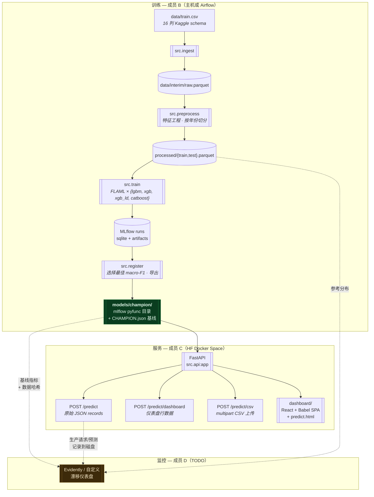
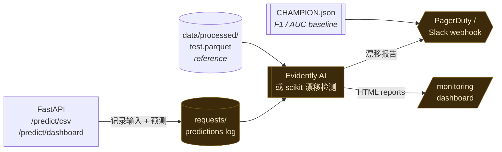

# F1 进站预测

> 二分类模型，用于预测 F1 车手是否会在**下一圈**进站。基于 Kaggle Playground Series **S5E6**（2022-2025）构建，覆盖从原始 CSV 到可部署实时推理界面的完整 MLOps 流程。

<p align="center">
  <a href="README.md">English</a>
</p>

<p align="center">
  <a href="https://t0myyy-f1-pit-predictor.hf.space/"></a>
  <a href="https://huggingface.co/spaces/T0MYYY/f1-pit-predictor"></a>
  
  
  
  
</p>

<p align="center">
  
  
  
  
  
  
</p>

<p align="center">
  
  
  
  
  
  
  
</p>

---

## 🔗 在线演示

| | URL |
|---|---|
| **仪表盘（HF Space）** | <https://huggingface.co/spaces/T0MYYY/f1-pit-predictor> |
| **应用直达地址** | <https://t0myyy-f1-pit-predictor.hf.space> |
| **CSV 批量推理界面** | <https://t0myyy-f1-pit-predictor.hf.space/predict.html> |
| **健康检查** | <https://t0myyy-f1-pit-predictor.hf.space/health> |

`GET /` 是比赛回放仪表盘（`REAL MODEL` 开关会把合成预测切换为实时 `predict_proba` 调用）。`GET /predict.html` 是拖放式 CSV 推理页面。`POST /predict`、`POST /predict/dashboard`、`POST /predict/csv` 是 JSON / multipart 端点，详见 [§ API 端点](#-api-端点)。

---

## 🚦 交接状态


A → B → C 已交付（仪表盘、REAL MODEL 开关、CSV 批量界面、HF Docker 部署）。D 是下一次交接，见 [§ 成员 D：漂移监控](#-成员-d漂移监控)。

---

## 🏗 架构



---

## ⚡ 快速开始

### 使用已训练的 champion 预测（无需训练）

Champion 已提交到 [`models/champion/`](models/champion/)（5.4 MB，通过 FLAML 训练的 XGBoost）。干净 clone 后即可提供预测服务。

```bash
git clone https://github.com/EdwardHuang777/F1-Pit-Stop-Prediction.git
cd F1-Pit-Stop-Prediction

python3.12 -m venv .venv && source .venv/bin/activate
pip install -r requirements.txt
pytest tests/                                            # 2/2 冒烟测试
python -m src.inference --input data/train.csv --year 2025   # 对 2025 holdout 批量预测
```

### 在本地运行完整推理 UI（HF Space 镜像）

```bash
pip install -r requirements.txt
uvicorn src.api:app --host 0.0.0.0 --port 7860
# 仪表盘:    http://localhost:7860/
# CSV 上传:  http://localhost:7860/predict.html
# 健康检查:  http://localhost:7860/health
```

### 复现 Docker 部署

```bash
docker build -f deploy/hf/Dockerfile -t f1-pit-predictor .
docker run -p 7860:7860 f1-pit-predictor
```

部署到自己的 HF Space：`python deploy/hf/push_space.py`（需要先执行 `hf auth login`，并更新 `REPO_ID` 常量）。

### 重新训练

```bash
python -m src.ingest         # ~2s
python -m src.preprocess     # ~30s
python -m src.train          # ~12 min（4 × FLAML @ 150s/algo）
python -m src.register       # ~5s · 写入 models/champion/
```

也可以通过 Airflow 运行（`docker compose up -d` → 在 <http://localhost:8080> 触发 `pit_stop_training`，登录 `admin/admin`）。

---

## 🔌 API 端点

[`src/api.py`](src/api.py) 暴露：

| 端点 | Body | 用途 |
|---|---|---|
| `GET /health` | — | 存活探针 |
| `POST /predict` | `{"records":[{...raw 15 cols}]}` | 原始整数标签端点，保留用于向后兼容 |
| `POST /predict/dashboard` | `{race, year, rows:[{driver, lap, compound, …}]}` | 仪表盘 `REAL MODEL` 开关触发的逐车手请求 |
| `POST /predict/csv` | `multipart/form-data file=…csv` | `/predict.html` 的拖放式 CSV 推理 |
| `GET /` | — | StaticFiles 挂载，提供 `dashboard/index.html` |

**在 Python 中直接加载 champion**（无需 API）：

```python
import mlflow.sklearn
model = mlflow.sklearn.load_model("models/champion")
probs = model.predict_proba(features_df)[:, 1]   # 原始概率
```

**输入形状。** DataFrame 需要包含 [`src/config.py:RAW_COLUMNS`](src/config.py) 中除 `PitNextLap` 以外的 15 个原始列。所有特征工程，包括 lag、rolling means、tyre-life buckets、early/late-race flags，都会在 `prepare_features()`（[`src/inference.py`](src/inference.py)）中重建。特征工程按 `(Year, Race, Driver, Stint)` 分组，因此**每次请求应发送完整的 driver-stint 历史**，这样 lag/rolling 特征才能正确填充。

**刷新节奏。** 训练流水线重新训练后，`models/champion/` 会原地更新。HF Space 上执行 `git pull` 并重启进程即可加载新模型；无需 schema 变更，也无需客户端改动。

---

## 🟡 成员 D：漂移监控

> **状态：未开始。** Hook 和基线已经就绪，监控本体由你构建。

已有三个工件：

1. **`models/champion/CHAMPION.json`** — 漂移基线：
   - `metrics.test_macro_f1`、`metrics.test_roc_auc` → 性能告警下限
   - `training_data.train_parquet_sha256` / `test_parquet_sha256` → 身份哈希。对传入数据重新计算并比较；差异不等于漂移，但说明数据集发生了变化。
   - `algorithm`、`best_hyperparams`、`trained_at_utc`、`git_sha`、`registered_version` → 告警载荷中的来源信息。

2. **`data/processed/test.parquet`** — 用于特征漂移检测的 **2025 参考分布**（Evidently AI 的 reference dataset slot、KS tests、PSI 等）。

3. **已部署的 FastAPI** — 在 [`src/api.py`](src/api.py) 的 `predict_dashboard` / `predict_csv` 中接入请求/预测日志，捕获生产输入和预测，再与参考分布比较。

### 提醒：2023 异常不是真实漂移

2023 年的下一圈进站率约为 0.96%，而 2022/2024/2025 约为 28%，这是 **Kaggle Playground 合成数据工件**，不是实际漂移。成员 A 已在 [`notebooks/EDA.ipynb`](notebooks/EDA.ipynb) §7 标注。如果仪表盘按年份切片，请将其标记为 `data-source artifact, not model drift`，避免值班人员追查错误方向。

### 建议架构



### 完成标准

- [ ] 持久化生产预测日志（jsonl 或 parquet，按日轮转）
- [ ] 每晚任务，将当天特征分布与 `data/processed/test.parquet` 比较
- [ ] 当任何带标签 holdout 的 macro-F1 低于 `CHAMPION.json.metrics.test_macro_f1` 超过 5% 时告警
- [ ] 仪表盘或 HTML 报告展示每天漂移最明显的 Top-N 特征
- [ ] 2023 式误报案例的运行手册

---

## 📂 仓库结构

```
F1-Pit-Stop-Prediction/
├── data/                          · 原始 Kaggle CSV + DVC 跟踪输出
├── notebooks/                     · 成员 A 的 EDA + 特征工程事实来源
├── src/                           · 可导入的流水线模块
│   ├── config.py                  · 路径、MLflow URI、RANDOM_SEED、AutoML 配置
│   ├── ingest.py                  · CSV → parquet（16 列 schema 检查）
│   ├── feature_engineering.py     · add_features() — 成员 A 单元格的逐字移植
│   ├── preprocess.py              · FE + 年份切分 + build_preprocessor()
│   ├── train.py                   · FLAML 每算法 AutoML，MLflow 每次运行日志
│   ├── register.py                · Champion 选择、MLflow Registry、导出
│   ├── inference.py               · prepare_features() · load_*_model() · CLI
│   └── api.py                     · FastAPI app — /predict, /predict/dashboard, /predict/csv
├── dashboard/                     · React + Babel SPA（CDN，无构建）+ predict.html CSV 页面
├── deploy/hf/                     · HF Docker Space — Dockerfile、requirements、push_space.py
├── dags/pit_stop_training_dag.py  · Airflow DAG — 4 个 BashOperator 包装 src.*
├── tests/                         · 导入 + config-path 冒烟测试
├── models/champion/               · ⭐ 交接载荷（供 API 和成员 D 使用）
├── docker-compose.yaml            · Airflow LocalExecutor + Postgres
├── Dockerfile                     · 训练镜像（apache/airflow:2.9.3-python3.12 + ML 依赖）
├── dvc.yaml / dvc.lock            · DVC 流水线（ingest、preprocess 阶段）
└── requirements.txt               · 固定版本
```

---

## 🏆 Champion 历史

| 版本 | 算法 | 测试 macro-F1 | 测试 ROC-AUC | 说明 |
|---|---|---:|---:|---|
| 1 | catboost | 0.7834 | 0.8944 | 主机训练，600s 预算。v1 register。 |
| **2** | **xgboost** | **0.7852** | **0.8945** | 第一个 DAG 训练的 champion。当前已部署。 |

**基线（成员 A 的 TyreLife≥25 启发式）：** macro-F1 ≥ 0.6122，ROC-AUC ≥ 0.7394。两个 champion 都高出 **+0.17 / +0.15**。

---

## 🛠 详细流水线参考

### A) 独立 Python（开发最快，约 12 分钟）

```bash
source .venv/bin/activate
python -m src.ingest        # ~2s
python -m src.preprocess    # ~30s
python -m src.train         # ~12 min（4 × FLAML @ 150s/algo + 额外开销）
python -m src.register      # ~5s
```

可用 `TIME_BUDGET=80 python -m src.train` 覆盖 AutoML 预算（总计 80s，约 2 分钟冒烟运行）。

### B) 通过 Docker 运行 Airflow DAG（生产编排，约 20-25 分钟）

```bash
mkdir -p mlflow              # 预创建 bind-mount 源目录（fresh clone 后一次性执行）
docker compose build         # 首次约 10 分钟；之后可复用缓存
docker compose up -d
# 打开 http://localhost:8080  → admin / admin → 触发 pit_stop_training
# 默认预算 {"time_budget": 600}。冒烟可用 {"time_budget": 80}。
docker compose down          # 完成后关闭
```

每个 `src.*` 都作为 `BashOperator` 子进程运行（不是 PythonOperator，后者会触发原生 ML 库的 fork-after-thread 问题）。

### C) DVC reproduce（仅数据阶段）

```bash
dvc repro                   # 重放 ingest + preprocess；不运行 train/register
```

### MLflow

- **Backend：** SQLite 位于 `mlflow/mlflow.db`，artifacts 位于 `mlflow/artifacts/`
- **Tracking URI：** `sqlite:///mlflow/mlflow.db`（[`src/config.py:21`](src/config.py#L21)）
- **UI：** `mlflow ui --backend-store-uri sqlite:///mlflow/mlflow.db --port 5001`

**主机 ↔ Docker 注意事项。** MLflow 会在创建 experiment 时把**绝对** artifact 路径写入 sqlite。主机运行生成的 DB 不能在 Docker 中使用，反之亦然。切换环境时，请先执行 `rm -rf mlflow/ mlruns/`。[`src/train.py:31-52`](src/train.py#L31-L52) 会检测过期的 `artifact_location` 并给出提示后快速失败。`models/champion/` 是持久交接产物，不受影响。

---

## ♻️ 可复现性

- **Python：** 主机和 Docker 内均为 3.12
- **随机种子：** 42，在 [`src/config.py`](src/config.py) 中设置，并通过 `clf__seed` 传入 FLAML
- **固定依赖：** [`requirements.txt`](requirements.txt)
- **数据身份：** `data/processed/*.parquet` 的 SHA256 存储在 `CHAMPION.json`
- **代码身份：** git SHA 存储在 `CHAMPION.json`

---

## ⚠️ 注意事项

- **首次 Docker build 约 10 分钟**（catboost + xgboost + lightgbm + arm64 wheels）。之后会使用缓存。
- **catboost 在 arm64 Docker 中较慢。** 600s 预算的 DAG 运行可能需要 20-25 分钟，主要耗在 catboost 上。主机 venv 约快 2 倍（没有 bind-mount I/O 惩罚）。
- **Docker 运行时不要 `rm -rf mlflow/`。** 请先执行 `docker compose down`；否则 bind mount 可能进入异常状态。
- **在主机 ↔ Docker 之间切换训练：** 环境切换前清理 `mlflow/` 和 `mlruns/`。`models/champion/` 会保留。
- **GitHub 会提示 `data/train.csv` 超过 50 MB。** 这是软警告，不会阻断；为方便评分已提交。
- **HF Space 部署需要 `flaml` 和 `lightgbm`**，即使 champion 是 XGBoost，因为 FLAML 训练包装器会在 pickle 中留下引用。见 [`deploy/hf/requirements.txt`](deploy/hf/requirements.txt)。

---

## 🤝 重新训练流程

1. 如数据有变化，先拉取最新数据。
2. `python -m src.train`（主机）或触发 Airflow DAG（Docker）。
3. `python -m src.register` 作为 DAG 最后一个任务运行；否则手动运行。
4. 检查 `models/champion/CHAMPION.json`，确认 `test_macro_f1` 超过上一版 champion。
5. `git add models/champion/ && git commit -m "Champion v{N}: {algo}, F1={X}"`。
6. `git push`，再运行 `python deploy/hf/push_space.py` 将新 champion 发布到 live Space；成员 D 更新漂移基线。

---

<sub>横幅：Pirelli F1 轮胎系列（Soft · Medium · Hard · Intermediate · Wet）。图片来自 Wikimedia Commons，CC BY-SA。</sub>
